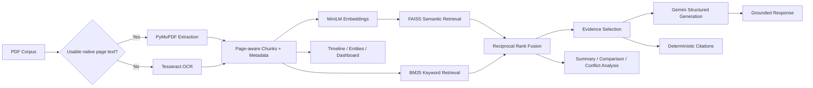

# Defence Policy Document Intelligence Assistant

A Streamlit grounded-RAG application for page-aware multi-PDF extraction, OCR,
combined-corpus semantic indexing, evidence retrieval, and concise policy
intelligence responses with deterministic source references.

## Problem statement

Defence and government policy corpora mix long native-text PDFs, scanned pages,
repeated terminology, deadlines, authorities, and document-specific obligations.
This project provides a local-first workflow for extracting, searching, comparing,
and citing that material while keeping generated analysis tied to real source pages.

## Key features

- Multi-document native extraction with page-level Tesseract OCR fallback
- Page-aware chunking, local MiniLM embeddings, FAISS, BM25, and reciprocal-rank fusion
- Grounded Gemini Q&A with schema validation and deterministic citations
- Executive summaries, comparison, conflict analysis, and evidence confidence
- Policy timelines, Entities & Facts, dashboard, and source-page navigation
- Content-hash persistence, large-document isolation, and failure recovery

## Architecture



## Processing pipeline

1. Each PDF receives a SHA-256 document ID and is processed independently.
2. PyMuPDF extracts native text page by page.
3. Sparse or image-only pages fall back to local Tesseract OCR.
4. Page text is split into overlapping chunks with document ID, filename, page,
   chunk ID, and extraction-method metadata.
5. `sentence-transformers/all-MiniLM-L6-v2` creates local embeddings for all chunks.
6. FAISS semantic and BM25 keyword rankings are combined with reciprocal-rank fusion.
7. Retrieval searches the full corpus or an optionally selected document.
8. Google Gemini generates an answer from selected evidence blocks only.
9. The application—not the LLM—deduplicates and displays citations from retrieved
   chunk metadata.

## Evidence selection and citations

Hybrid retrieval returns up to four ranked chunks for transparency. Before generation,
the application removes obvious weak matches using both a small absolute cosine
floor and a score window relative to the best result. This adaptive combination
avoids treating one fixed score as universally meaningful while retaining closely
related context. Gemini returns structured evidence IDs such as `E1`; the app
validates those IDs against retrieved chunks and constructs filename, page, chunk,
and extraction-method citations from stored metadata only.

## Tech stack

- Python 3.12 and Streamlit
- PyMuPDF, Tesseract, pytesseract, and Pillow
- LangChain text splitters
- Sentence Transformers with `all-MiniLM-L6-v2`
- FAISS with deterministic BM25/RRF hybrid retrieval
- Google `google-genai` with Pydantic structured responses
- JSON/NumPy local persistence with integrity checks

## macOS setup

Create and activate a Python 3.12 environment:

```bash
python3.12 -m venv venv
source venv/bin/activate
python -m pip install --upgrade pip
```

Tesseract is a system dependency and is not installed by `pip`. Install it with
Homebrew, then install the Python dependencies:

```bash
brew install tesseract
source venv/bin/activate
pip install -r requirements.txt
```

## Gemini configuration

The application uses Google's official `google-genai` SDK with
`gemini-3.6-flash` as the default generation model. Set `GEMINI_MODEL` to override
it with a model available to your project. Quota errors never switch models. Create an API key in
[Google AI Studio](https://aistudio.google.com/app/apikey), then copy the
environment template and add the key locally:

```bash
cp .env.example .env
```

Required setting:

```dotenv
GEMINI_API_KEY=your_key_here
```

Do not commit `.env`. It is excluded by `.gitignore`. As an alternative, place
the same names in `.streamlit/secrets.toml`; that file is also ignored.

Verify Tesseract and start the application:

```bash
tesseract --version
streamlit run app.py
```

Example grounded queries:

- `What eligibility requirements are explicitly stated?`
- `Which authority is responsible for implementation?`
- `What deadlines and monetary thresholds appear in the corpus?`
- `Compare the reporting obligations in the selected documents.`

Upload a scanned or image-only PDF. Pages that need OCR show progress during
processing and are then chunked, embedded, and indexed like native-text pages.
Without `GEMINI_API_KEY`, semantic retrieval and supporting evidence still work;
only answer generation is skipped.

## Large-document performance

Document processing and embeddings are cached by the PDF's SHA-256 content hash,
not by its filename. Re-uploading the same bytes therefore reuses extraction,
OCR, chunks, and embeddings even after an application restart. Renaming a file
updates its displayed metadata without repeating the expensive work. Adding one
new PDF processes and embeds only that PDF, then rebuilds the in-memory combined
FAISS index from the cached per-document vectors.

Embeddings use a conservative batch size of 16 chunks, automatically reducing to
8 or 4 for very large chunk sets, and the FAISS index is populated one document
matrix at a time. PDF raster images used by OCR are also released after each
page. The interface reports extraction, OCR, chunking, embedding, and indexing
progress and includes a processing-diagnostics panel with cache hits, batch
counts, content hashes, and elapsed time.

The application accepts PDFs up to 100 MB and 500 pages per document. Files at
least 25 MB or 75 pages receive a large-document notice but continue processing.
The document preview is capped at 150,000 characters to avoid retaining another
full-corpus text copy in memory.

Persistent cache files live under `.cache/defence_policy_rag`, use hash-only paths,
and are excluded from Git. They contain extracted document text and embeddings,
so protect or clear this local directory when working with sensitive material.
The **Local Document Cache** panel reports cache size and provides a confirmed
clear-cache action. Document data is stored as validated JSON and embeddings as
NumPy arrays with pickle loading disabled; API keys and application secrets are
not cache fields. Writes use same-directory atomic replacement, and integrity
hashes protect document records and embedding matrices. Corrupt, changed-model,
or incompatible entries are ignored and regenerated automatically.

On Streamlit Community Cloud this cache is an optimization only. The deployment
filesystem is ephemeral, so cached extraction and embedding data can disappear
when the app restarts, is redeployed, or moves to another worker. The application
creates missing cache directories automatically and continues with session-only
caching if persistence is unavailable.

## Deployment — Streamlit Community Cloud

The deployment entry point remains `app.py`; the equivalent local command is
`streamlit run app.py`.

1. Push the project to a private or public GitHub repository. Confirm that `.env`,
   `.streamlit/secrets.toml`, `.cache/`, and `venv/` are not committed.
2. Sign in to [Streamlit Community Cloud](https://share.streamlit.io/), choose
   **Create app**, select the repository and branch, and choose **Python 3.12**
   in Advanced settings. Community Cloud currently defaults to Python 3.12, but
   selecting it explicitly makes the deployment choice clear.
3. Set the main file path to `app.py`.
4. In the app's **Advanced settings → Secrets**, add this placeholder with your
   real key supplied only through Streamlit's secret editor:

   ```toml
   GEMINI_API_KEY = "YOUR_KEY"
   ```

5. Deploy the app. `requirements.txt` installs Python dependencies and
   `packages.txt` installs the Debian `tesseract-ocr` package.
6. Upload a scanned PDF and confirm that the document metrics report OCR pages.
   The application also reports a clear diagnostic if the Tesseract executable is
   unexpectedly unavailable on `PATH`.

Community Cloud resources are shared and constrained. The application limits a
single PDF to 100 MB and 500 pages, warns at 25 MB or 75 pages, processes OCR one
page at a time, reduces oversized OCR rasters, and embeds chunks in bounded
batches. Large or concurrent corpora may still exceed the instance's memory or
execution limits. Local cache contents are not durable storage, and the MiniLM
model may need to download again after a cold start.

## Policy intelligence features

The Query Assistant uses top-four hybrid retrieval and grounded Gemini generation.
Additional workspace sections reuse the same cached corpus and evidence metadata:

- **Executive Summary** retrieves representative evidence for purpose, themes,
  requirements, dates, responsibilities, restrictions, and exceptions. Whole-
  corpus summaries retrieve within each document so smaller documents are not
  crowded out. Results are cached by corpus and selected-document hash.
- **Policy Comparison** searches Document A and Document B independently. Evidence
  IDs remain separated with `A` and `B` prefixes, and unsupported comparison
  sections are omitted. Results are cached by both document hashes and the optional
  comparison question.
- **Conflict Analysis** requires bilateral evidence before displaying a potential
  conflict; non-mention remains insufficient evidence.
- **Policy Timeline** retains exact, month-only, fiscal, and relative date expressions
  without inventing calendar precision.
- **Entities & Facts** extracts explicitly present entities and factual values with
  page-level references.
- **Intelligence Dashboard** aggregates processing and cached analysis metadata
  without invoking OCR, embeddings, FAISS construction, or Gemini.
- **Source Viewer** resolves citations to existing page and chunk metadata.
- **Corpus Overview** presents corpus and per-document processing totals without
  rerunning extraction, OCR, embeddings, or indexing.

Executive summaries, comparisons, and individual query responses can be exported
as Markdown intelligence reports. Reports are assembled from existing validated
application results and retrieved metadata; downloading a report does not make a
new Gemini request.

## Security considerations

- Uploaded text is explicitly marked as untrusted evidence in Gemini prompts.
- Model-returned evidence IDs are allow-listed against retrieved context.
- Filenames and page numbers come from application metadata, not model output.
- `.env`, Streamlit secrets, virtual environments, and local caches are Git-ignored.
- Cache formats do not use pickle and explicitly exclude credential fields.
- Cached extracted text is plaintext local data; clear it after sensitive work.

## Known limitations

- OCR quality depends on scan resolution, orientation, language, and layout.
- Local FAISS/BM25 indexes target portfolio-scale corpora, not distributed search.
- Entity extraction is conservative and pattern-based; aliases are not merged using
  external knowledge.
- Gemini availability, quotas, and model access depend on the configured API account.
- Generated intelligence must be verified against cited source documents.

## Future improvements

- Formal evaluation datasets for retrieval, OCR, citations, and abstention
- Optional multilingual OCR and entity patterns
- Structured observability and configurable operational limits for hosted use
- A reproducible dependency lock for tagged releases


## Executive Summary deployment and diagnostics

Install the updated `requirements.txt` (the retry controls require
`google-genai>=1.75,<2`) and reboot the Streamlit deployment. In Streamlit Cloud,
set these top-level entries in **App settings → Secrets**:

```toml
GEMINI_API_KEY = "YOUR_EXISTING_VALID_AI_STUDIO_KEY"
GEMINI_MODEL = "gemini-3.6-flash" # verified; also the application default
```

Set `GEMINI_MODEL` explicitly to `gemini-3.6-flash`. Live checks with the local
application key and SDK found that `3.7` and `3.8` returned ServerError HTTP 503
for a minimal Reply OK request, while `3.6` passed that request and a synthetic
PDF summary. This verifies a working configuration at test time, not permanent
availability or the deployed account's state. The original `3.7` and selected
`3.6` models are listed in Google's [model catalog](https://ai.google.dev/gemini-api/docs/models).
Availability for a particular project must be checked with that project's key.
`GOOGLE_API_KEY` is accepted as an alias. This application resolves nonblank
`GEMINI_API_KEY` before `GOOGLE_API_KEY`, environment before Streamlit secrets;
a stale environment key can therefore override your secrets. Local `.env` is
loaded without replacing existing environment variables. Client reuse is scoped
to the resolved key; summary results are confined to each Streamlit session.
The configuration indicator checks client setup only, not live service health.

Summary requests use a 45-second per-attempt timeout, at most three attempts,
exponential backoff plus jitter, and server Retry-After/RetryInfo delays. If the
server asks for more than 30 seconds, the app stops instead of retrying early.
Daily/zero quota, authentication, permissions, unknown failures, invalid input,
and unavailable models are not automatically retried. SDK retries are disabled.
Malformed structured output/token truncation gets one bounded repair request;
safety blocks and empty responses do not. Rate limits, service errors, network
failures, and timeouts receive bounded retries. See Google's
[error guidance](https://ai.google.dev/gemini-api/docs/troubleshooting) and
[SDK reference](https://googleapis.github.io/python-genai/).

Server diagnostics include category, HTTP status, original exception class,
allowlisted fragments of its original error message, model, attempt, input byte
count, and traceback frames (including chained exceptions). Unknown message text
is redacted. Tracebacks omit locals, source lines and full paths; raw provider
payloads, headers, keys, prompts and document text are never logged. Standard
`logger.exception`/`exc_info` formatting is deliberately avoided because it can
print secret-bearing exception strings or source lines. The old quoted "temporarily unavailable" message was emitted
only for 500/502/503/504 in this checkout, but it discarded the status and type
from summary logs. Without the deployed exception/logs, its precise cause is
unverified. After redeployment, look for `Gemini attempt failed` or
`Gemini request failed` in Streamlit server logs to identify the actual failure.

The selected scope is filtered before hashing or generation. Successful summaries
are keyed by source text/metadata, model, and versioned summary settings in session
state. Normal reruns reuse the displayed summary; **Regenerate Summary** explicitly
requests a new generation. Failed requests never enter the success cache. Local
fallback excerpts are stored separately and labeled in both the UI and exported
report; they never call another provider. Cache clearing removes both forms.

Large extracted chunks are split while preserving page metadata. A conservative
UTF-8 byte bound estimates text tokens, with an instruction/schema reserve, so
non-English text does not rely on an English characters-per-token heuristic.
Hierarchical map/reduce summaries resolve intermediate citations to original
source chunks. Each reduce stage is bounded and concise; this is an overview,
not an exhaustive list of every provision. Local fallback ranks verbatim source
sentences and distributes excerpts over available source pages. Empty/unreadable
extraction is rejected before any summary generation; inspect native text/OCR.

Offline focused checks (no live API key required):

```bash
python tests/summary_reliability.py
python tests/gemini_model_failover.py
python tests/shared_gemini_client.py
python tests/structured_response_parsing.py
python tests/token_budget_regression.py
python tests/intelligence_features.py
python tests/production_stabilization.py
```

## Reproducing the model failure and deploying the fix

Run this command with the same configuration as the app (it performs real API
requests and consumes a small amount of quota):

```bash
python scripts/verify_gemini.py --pdf-smoke
```

The diagnostic uses the application's credential/model resolver, cached SDK
client, API endpoint and timeout. It checks `models.list` for `generateContent`,
then sends a single minimal `Reply OK` request with no application retry/fallback.
Only after that succeeds does `--pdf-smoke` create a synthetic one-page PDF,
extract its text, summarize it and verify references. It prints pass/fail and
sanitized exception diagnostics, never headers, keys or source/response content.
Do not enable SDK/HTTP debug logging when investigating a real uploaded PDF.

Latest live results in this workspace on 2026-10-03, google-genai 1.75.0:

| Model | Listed with generateContent | Reply OK | Synthetic PDF summary |
| --- | --- | --- | --- |
| gemini-3.7-flash | Yes | HTTP 503 initially; later control passed | Skipped after initial failed prerequisite |
| gemini-3.8-flash | Yes | ServerError, HTTP 503 | Skipped after failed prerequisite |
| gemini-3.6-flash | Yes | Passed twice | Passed twice: 5 then 4 sections, 1 page reference |

These checks used locally configured credentials, not the deployed Streamlit
runtime. The earlier synthetic summary on `3.7` had succeeded, so the evidence
supports a current generation failure, not an invalid model ID or a permanent
outage. A later `3.6` PDF request reported `ServerError`, HTTP 503,
`UNAVAILABLE`, and "high demand" in the sanitized diagnostics, then succeeded
within the bounded retry budget. A final minimal `3.7` control also passed.
These observations establish intermittent capacity/service failures; they do
not establish the precise backend cause of the earlier `3.7`/`3.8` failures.
Changing the default to verified `3.6` is a configuration mitigation, not a
permanent cure for provider capacity. The previous committed retry statement logged no exception and also classified failures from
the word "unavailable" alone. That classifier now requires appropriate error
status/type; authentication, model configuration and daily/zero quota never retry.

The selected and locally verified deployment setting is:

```toml
GEMINI_MODEL = "gemini-3.6-flash"
```

Keep your existing valid `GEMINI_API_KEY`. Local `.env` and `.env.example` have
been updated to the same model; `.env` remains ignored and must not be committed.
A deployed environment `GEMINI_MODEL` takes precedence over Streamlit Secrets,
so update/remove any stale environment override too. Model resolution is nonblank
environment (including local dotenv), then top-level Streamlit Secrets, then the
application default. `models.list` support is not a service-health guarantee;
the minimal generation request is the actual availability check.

Deployment targets `origin/main`. Once the prepared local main commit is pushed,
Streamlit Cloud should rebuild from the changed requirements. Save the model
setting above in **App settings → Secrets**, then **Reboot app**. Confirm the
startup code is the new revision and test a selected PDF. If it fails, collect
the sanitized `Gemini attempt failed` event with message/status/traceback. The
old `Gemini transient failure` line means the old revision is still running.

The focused summary and diagnostic suites contain 20 offline tests, including
original/chain traceback redaction, exception-message confidentiality, model
resolution precedence, unsupported-model classification, minimal-probe ordering,
and prohibition of PDF calls after a failed minimal prerequisite. The existing
nine regression scripts and Streamlit startup/ordinary rerun smoke checks passed.

Additional offline checks:

```bash
python tests/verify_gemini.py
python tests/summary_reliability.py
```

## Research Paper Integrity Analysis

The **Research Paper Integrity** tab is independent of the existing corpus and
Gemini features. Upload the submitted PDF and optional reference PDFs in this
tab. Extraction, citation parsing and passage comparison run locally on the
Streamlit server. Papers, extracted text, embeddings and results are not placed
in the shared document disk cache or sent to Gemini. Each session owns its
uploads/results. **Clear private integrity uploads and results** removes the
workflow state and resets its upload widgets. Hosting administrators still
control the server; this is not end-to-end encrypted storage.

The interface separates three analyses and downloads a Markdown report with
actual matching passages, document/page references, source URLs, coverage,
methodology, consent settings and limitations. Evidence is paginated in the UI;
the report and percentages use all detected matches. Downloading or ordinary Streamlit
reruns do not issue new external requests. Changing uploads resets consent;
changing consent/settings hides results belonging to the previous configuration.

### Citations and source identity

- Extracted pages retain PDF page numbers. Sparse pages use local Tesseract OCR;
  unreadable pages and OCR use are reported. Integrity uploads are limited to
  25 MB and 300 pages per PDF.
- Supported bibliography headings include References, References and Notes,
  Bibliography, Works Cited, Literature Cited and Reference List. Reference
  parsing supports numbered entries and common surname/initial author-year
  entries. In-text parsing supports numeric brackets/lists/ranges, common
  parenthetical/narrative author-year forms and DOI identifiers. Missing and
  ambiguous bibliography mappings are different statuses. Superscripts,
  unusual layouts, non-Latin citation styles and complex line wrapping may need
  manual review. No detected heading means bibliography exclusion may be
  incomplete; the app and report state this explicitly.
- An exact Crossref DOI record verifies the record's existence. It does not
  establish that the bibliography title/authors/year are correct or that the
  paper used the source. Bibliographic search results without an exact DOI are
  shown as **unverified candidates**, never automatically adopted as references.
- For an uploaded comparison paper, explicitly select its bibliography entry
  if it is the same source. The association is recorded as user-confirmed, not
  scholarly verification. Without that association, a text match remains a
  discovered/checked source; topic or semantic similarity never establishes use.
  Europe PMC full text is associated only through an exact verified DOI.

### Text similarity methodology and coverage

The displayed label is **similarity within checked sources**, not a plagiarism
score. A zero result does not imply originality. Common methods language,
boilerplate, quotations, properly cited material and coincidental overlap may
be benign. Neither similarity nor an AI-writing detector establishes misconduct.

Word tokens use Unicode NFKC normalization and case folding. Whitespace,
punctuation and case changes are ignored. Exact runs require at least eight
matching tokens. Near-exact candidate pairs use non-overlapping 60-word windows,
a token sequence ratio of at least 0.88, and at least eight identical tokens.
Only actually matching token positions contribute to overlap; substitutions in
a near-exact passage do not count. The denominator is the number of examined
non-bibliography submitted-body tokens, including quotations and citation marker
tokens. The numerator is the union of matched submitted positions across all
exact and near-exact matches. Duplicated/overlapping matches cannot inflate it.
The app reports unique matched tokens and the denominator so the calculation
can be reproduced.

Quotation boundaries and nearby mapped citations are shown separately.
A quotation without an established source-citation association still requires
review and enters potentially unattributed overlap. Any observed mapped source
citation at the same matched positions removes those positions from that subset;
quotation/citation parsing is heuristic, not proof of correct attribution.
Quoted-and-source-cited overlap is a separate subset of total overlap.
Bibliography sections are excluded from both submitted and uploaded source text
when detected; Europe PMC comparison uses article body XML, excluding the back
bibliography.

Comparison limits are explicit: first 20,000 submitted-body tokens, first 50,000
source-body tokens, ten source attempts, first 1,000 60-word windows, ten lexical
candidates/window and twenty source positions per exact seed. These bounds can
miss alignments, short reuse and paraphrases. Coverage lists checked, unreadable,
duplicate, unconsented, unavailable and limited sources, source links, token
counts, retrieval timestamps/licenses where returned, semantic status, and how
much extracted submitted text was examined. The search is not an internet-wide,
publisher-database or paywall search.

Optional semantic comparison uses local
`sentence-transformers/all-MiniLM-L6-v2` cosine similarity (threshold 0.82).
It returns actual submitted/source windows and the cosine value separately;
semantic matches contribute **zero** tokens to the overlap percentage. It is an
exploratory English-oriented model, not a paraphrase/plagiarism verdict.
The integrity workflow loads this model with `local_files_only=True`; it never
downloads it. Pre-cache the model in the deployment environment if this option
is needed. If unavailable or encoding fails, lexical analysis is retained and
the semantic coverage/status is reported. No paper text is sent to an embedding
service.

### Bibliography parsing and reference verification

The integrity pipeline preserves native PDF text line order and original page
numbers; OCR pages are marked for review. Repeated margin headers/footers and
page-number lines are removed conservatively. A standalone bibliography heading
must be followed by reference-shaped entries; body mentions, year patterns and
table-of-contents headings do not establish a boundary. Headingless physics-style
bibliographies require a dense run of validated surname/initial/year entry starts
in the latter half of the document. This is a conservative structural heuristic,
not universal layout recognition; unfamiliar layouts can remain undetected.

Entries continue across lines and pages. Numbered and common author-year formats,
including surname/initial/year physics references, are supported. Author lists,
titles and years are bounded and validated. Missing/uncertain fields stay empty;
**Unparsed reference** retains an excerpt and original pages, and is never sent
to a metadata service. Citation mapping uses these corrected local identities.
Verified DOI metadata, search candidates, unparsed entries, lookup failures and
unchecked entries retain separate statuses. Markdown reference tables escape
pipes/markup, collapse whitespace and cap cells at 96 characters; full source
evidence appears outside tables.

Crossref and Europe PMC retry HTTP 429/502/503/504 at most twice after the initial
attempt, with exponential backoff and jitter. Retry-After seconds or dates are
honored; waits above five seconds return an unavailable status instead of retrying
early. Invalid requests are not retried. Successful metadata results are cached
privately for the current upload; failed lookups are not cached as successes.
The UI/report show checked/cached coverage, unparsed exclusions and the 25-entry
metadata limit. This is metadata coverage, not internet-wide source coverage.

### Free experimental local AI-writing assessment

The default detector is
[MayZhou/e5-small-lora-ai-generated-detector](https://huggingface.co/MayZhou/e5-small-lora-ai-generated-detector),
pinned to revision `483fc4969592dc20e00e5130e7187b5dd25dbcc7`.
Its model card declares MIT, 33.4M parameters, RAID and GPT-4o-mini rewritten-tweet
training, and self-reported accuracy 89.0%, F1 0.887 and AUC 0.976 (the card also
lists a separate RAID-test accuracy 0.939). These are published evaluation results,
not accuracy guarantees on uploaded research papers. The
[base model card](https://huggingface.co/intfloat/e5-small) supports English only;
other/unknown languages receive no assessment. The detector card does not specify
calibration or runtime RAM requirements. Academic writing, edited prose and
unseen generators can cause false positives and false negatives.

No subscription, API key or detector account is needed. The model files occupy
about 134 MB; only public model files are downloaded to ignored
`.cache/local-detector`. CPU-only lazy loading uses a single Streamlit cached
resource and inference lock, safetensors, and `trust_remote_code=False`. Cached
files are loaded offline first. Existing Torch/Transformers dependencies are
reused; no LoRA runtime or extra inference provider is needed. Paper text and
scores stay on the app server/session, and are never sent to Hugging Face or Gemini.
Run/download reruns do not load duplicate models or resubmit papers.

Each passage is measured using the actual fast tokenizer, including special
tokens, with a 512-token total limit. Windows back off to whole-word boundaries;
no text is silently truncated. Oversized words, passage limits and failed
inference are recorded as skipped coverage. The default budget is 200 passages,
configurable up to 1,000 in the UI. Native PDF page attribution is preserved.
The actual label-1 **uncalibrated softmax classifier score** appears per passage;
no averaged document probability or calibrated authorship claim is invented.
The overall assessment is explicitly uncertain.

Passages with score **≥ 0.8** are flagged by default. This is an application cutoff,
not a validated academic-writing threshold, and can be adjusted in the UI.
**Analyzed text flagged as potentially AI-generated** = unique flagged analyzed
word-token positions / unique successfully analyzed word-token positions × 100.
Overlapping/duplicate positions count once. Bibliography entries are excluded;
coverage reports analyzed/total body words, skipped words/text, pages and excluded
reference words. Unanalyzed text is never counted as human. This is not the actual
percentage of AI used and is independent of source similarity. Errors yield no
invented score or heuristic substitute.

Optional top-level Streamlit Secrets or local `.env` defaults (neither required):

```toml
LOCAL_AI_THRESHOLD = "0.8"
LOCAL_AI_MAX_PASSAGES = "200"
```

Invalid defaults produce an actionable warning and disclosed fallback defaults.
Users can override both settings in the UI. Initial downloads require outbound
HTTPS access to Hugging Face; prepopulate the pinned cache for offline hosting.

Measured locally on macOS: the real CPU smoke test peaked at **673.3 MiB RSS**
and took 28.13 seconds including first download/loading. An offline cached-file
run took 4.2 seconds with 571.6 MiB peak for the short smoke test. The model card provides
no RAM guarantee. [Streamlit's resource documentation](https://docs.streamlit.io/deploy/streamlit-community-cloud/manage-your-app#resource-limits)
lists approximately 690 MB–2.7 GB memory and up to two CPU cores, with limits
subject to change. Standalone memory leaves little room at the minimum allocation;
allow headroom for the existing embedding/index resources and concurrent sessions
(target at least 1 GB, preferably more). Actual combined memory and Cloud allocation
must be checked in deployment; this local measurement does not verify Cloud fitness.
Memory, language, download and inference failures produce clear unavailable/partial
coverage messages. There is no automatic switch to a paid API.

### Optional external services and consent

Crossref, Europe PMC and optional GPTZero require their own explicit checkbox
and the Run action. Enabling a checkbox sends nothing. Their consent is scoped
to uploaded content. The local detector sends no paper contents externally;
its initial model-file download is separate from external paper analysis.

| Service | What is sent with consent | Requirement | Scope |
| --- | --- | --- | --- |
| Crossref | Reference DOIs or up to 1,000 characters per validated entry | No API key | First 25 entries; DOI verification or unverified candidates |
| Europe PMC | Verified bibliography DOI identifiers | No API key; Crossref consent | Up to five OA sources within the ten-source limit |
| GPTZero | Non-bibliography text excerpt | Optional API subscription/settings | Only when explicitly selected and consented; never required for local detection |

The adapters follow the official
[Crossref REST documentation](https://github.com/CrossRef/rest-api-doc),
[Europe PMC REST documentation](https://europepmc.org/RestfulWebService),
and [open-access subset](https://europepmc.org/downloads/openaccess).
Only exact DOI-matched, open-access Europe PMC records with PMCIDs are fetched;
no arbitrary-URL scraping or paywall bypass. XML full text has no PDF page numbers.

For optional GPTZero, put these **top-level** settings in Streamlit Secrets or
local environment variables (environment values take precedence):

```toml
GPTZERO_API_KEY = "YOUR_GPTZERO_API_KEY"
GPTZERO_MODEL_VERSION = "YOUR_ACCOUNT_SUPPORTED_MODEL_VERSION"
GPTZERO_MAX_CHARACTERS = "YOUR_ACCOUNT_CONFIRMED_PER_REQUEST_CHARACTER_LIMIT"
```

Choose an explicit version supported by your account using the provider's
[current API documentation](https://gptzero.me/developers). No default detector
version is invented. The adapter uses `POST /v2/predict/text`, `x-api-key`,
`document` and `version`. It accepts documented `document_classification` and
`class_probabilities` responses. These class probabilities express confidence
in the HUMAN_ONLY/MIXED/AI_ONLY classification for similar documents, **not the
percentage of the paper written by AI**. Requested and provider-reported versions
are displayed separately; absence of a reported version is disclosed. Provider
sentence flags use the documented boolean `highlight_sentence_for_ai`. The application
adds no probability threshold. Only exact, uniquely aligned provider passages are
highlighted, with original page references. Ambiguous repeated passages are omitted
and disclosed. Numeric sentence fields remain uninterpreted provider evidence.

**AI-generation probability** is `class_probabilities.ai` (confidence in AI_ONLY),
not the proportion of AI-written text. Mixed-class confidence remains separate.
**Percentage of analyzed text flagged as potentially AI-generated** is the union
of flagged analyzed word-token positions divided by all analyzed non-bibliography
word-token positions × 100. Overlapping/duplicate flags count once. Word tokens
use Unicode NFKC/case-fold normalization and the existing word tokenizer. The
percentage is available only when validated boolean sentence flags cover every
submitted word. Incomplete/absent/ambiguous passage results produce no percentage;
valid highlights still appear. This percentage is not the actual amount of AI used.
Bibliography exclusion is heading based; review extraction notes for unsupported layouts.

Set the positive `GPTZERO_MAX_CHARACTERS` using the per-request limit confirmed
in your GPTZero API account; the local implementation ceiling is 1,000,000.
The publicly readable docs did not establish a universally applicable API limit
or a current account-supported model version, so neither is guessed. Long papers
send only an opening excerpt within that configured limit, trimming at a word
boundary. The consent UI announces this behavior. Coverage lists analyzed/total
body words, characters and pages; verdicts and probabilities apply to that excerpt
only. One request is used; chunk probabilities are never averaged. No API call
occurs on ordinary Streamlit reruns or downloads; private results remain scoped
to the session, document and detector settings. Clearing uploads removes results.

Missing settings, absent consent, unreadable text, invalid responses, credentials,
quota/rate limits, unsupported configuration, timeouts and server failures have
actionable explanations, with no inferred scores and no automatic paid retries.
Logs contain exception class and HTTP status only, never payloads or keys. Failed
submission attempts are recorded because text may already have reached GPTZero.
Local observations are separate and are not detector evidence. False positives,
language, genre, editing and distribution shift limit all assessments.

### Optional GPTZero and deployment

GPTZero remains available only through the explicitly selected external backend
and consent gate. Its [official setup guide](https://support.gptzero.me/articles/5840144813-how-can-i-get-the-api-and-request-code-samples)
requires an API subscription/key. Its version and input limit must be confirmed
in that account; local operation requires none of these settings.

Push the tested changes to the deployed `main` branch. Streamlit Cloud reinstalls
changed requirements; reboot through **Manage app → Reboot app** if needed.
Use **Local CPU (free)** (default), choose English, set threshold/coverage budget,
and press Run. No Gemini settings need changing. The first local detection may
pause while downloading model files. Review memory logs and coverage before use.
No deployed detector success is claimed until that app is exercised.

### Verification

```bash
python tests/bibliography.py
python tests/local_ai_writing.py
python tests/ai_writing.py
python tests/research_integrity.py
python tests/integrity_ui.py
python scripts/check_local_detector.py  # Real CPU inference; downloads public files if needed
python scripts/check_steane_bibliography.py /path/to/public-steane.pdf
```

Real local inference succeeded using the pinned model and synthetic non-private
text; a 1,540-word fixture used four passages, at most 512 tokens each, with 100%
word coverage and one cached resource. 62 detector/integrity tests and 16 summary
regressions passed, plus shared-client, response parsing, token budgeting, report
export, production checks, full Streamlit startup/rerun, compilation and diff checks. Offline tests use mocked scores for token splitting, word unions, failure
coverage, reports, consent and rerun behavior; they do not establish detector
accuracy. Existing Gemini summary/client/parsing/token-budget and report checks
are also run before deployment.

A real public regression used Andrew Steane's *Quantum Computing*,
[arXiv quant-ph/9708022](https://arxiv.org/abs/quant-ph/9708022): 65 pages, 137
reference entries on pages 43–50; 121 parsed and 16 explicitly unparsed; 149
citation markers mapped; maximum parsed author-field length 32 characters, with
no body headings in author fields. The original uploaded PDF/faulty report was
not available locally, so this public edition is not confirmed identical to it.
The PDF is kept outside Git. Structural parsing and fields still require human
review; no external metadata verification of these entries is claimed.

Earlier public Crossref/Europe PMC fixture checks succeeded. GPTZero remains
mock-tested/documentation-checked without live credentials. This update verifies
local behavior, not Streamlit Cloud memory, downloads or deployed inference.
