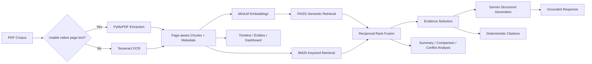

# Defence Policy Document Intelligence Assistant

A Streamlit grounded-RAG application for page-aware multi-PDF extraction, OCR,
combined-corpus semantic indexing, evidence retrieval, and concise policy
intelligence responses with deterministic source references.

## Problem statement

Defence and government policy corpora mix long native-text PDFs, scanned pages,
repeated terminology, deadlines, authorities, and document-specific obligations.
This project provides a local-first workflow for extracting, searching, comparing,
and citing that material while keeping generated analysis tied to real source pages.

## Key features

- Multi-document native extraction with page-level Tesseract OCR fallback
- Page-aware chunking, local MiniLM embeddings, FAISS, BM25, and reciprocal-rank fusion
- Grounded Gemini Q&A with schema validation and deterministic citations
- Executive summaries, comparison, conflict analysis, and evidence confidence
- Policy timelines, Entities & Facts, dashboard, and source-page navigation
- Content-hash persistence, large-document isolation, and failure recovery

## Architecture



## Processing pipeline

1. Each PDF receives a SHA-256 document ID and is processed independently.
2. PyMuPDF extracts native text page by page.
3. Sparse or image-only pages fall back to local Tesseract OCR.
4. Page text is split into overlapping chunks with document ID, filename, page,
   chunk ID, and extraction-method metadata.
5. `sentence-transformers/all-MiniLM-L6-v2` creates local embeddings for all chunks.
6. FAISS semantic and BM25 keyword rankings are combined with reciprocal-rank fusion.
7. Retrieval searches the full corpus or an optionally selected document.
8. Google Gemini generates an answer from selected evidence blocks only.
9. The application—not the LLM—deduplicates and displays citations from retrieved
   chunk metadata.

## Evidence selection and citations

Hybrid retrieval returns up to four ranked chunks for transparency. Before generation,
the application removes obvious weak matches using both a small absolute cosine
floor and a score window relative to the best result. This adaptive combination
avoids treating one fixed score as universally meaningful while retaining closely
related context. Gemini returns structured evidence IDs such as `E1`; the app
validates those IDs against retrieved chunks and constructs filename, page, chunk,
and extraction-method citations from stored metadata only.

## Tech stack

- Python 3.12 and Streamlit
- PyMuPDF, Tesseract, pytesseract, and Pillow
- LangChain text splitters
- Sentence Transformers with `all-MiniLM-L6-v2`
- FAISS with deterministic BM25/RRF hybrid retrieval
- Google `google-genai` with Pydantic structured responses
- JSON/NumPy local persistence with integrity checks

## macOS setup

Create and activate a Python 3.12 environment:

```bash
python3.12 -m venv venv
source venv/bin/activate
python -m pip install --upgrade pip
```

Tesseract is a system dependency and is not installed by `pip`. Install it with
Homebrew, then install the Python dependencies:

```bash
brew install tesseract
source venv/bin/activate
pip install -r requirements.txt
```

## Gemini configuration

The application uses Google's official `google-genai` SDK with
`gemini-3.7-flash` as the primary generation model and `gemini-3.6-flash` as a
quota fallback. Create an API key in
[Google AI Studio](https://aistudio.google.com/app/apikey), then copy the
environment template and add the key locally:

```bash
cp .env.example .env
```

Required setting:

```dotenv
GEMINI_API_KEY=your_key_here
```

Do not commit `.env`. It is excluded by `.gitignore`. As an alternative, place
the same names in `.streamlit/secrets.toml`; that file is also ignored.

Verify Tesseract and start the application:

```bash
tesseract --version
streamlit run app.py
```

Example grounded queries:

- `What eligibility requirements are explicitly stated?`
- `Which authority is responsible for implementation?`
- `What deadlines and monetary thresholds appear in the corpus?`
- `Compare the reporting obligations in the selected documents.`

Upload a scanned or image-only PDF. Pages that need OCR show progress during
processing and are then chunked, embedded, and indexed like native-text pages.
Without `GEMINI_API_KEY`, semantic retrieval and supporting evidence still work;
only answer generation is skipped.

## Large-document performance

Document processing and embeddings are cached by the PDF's SHA-256 content hash,
not by its filename. Re-uploading the same bytes therefore reuses extraction,
OCR, chunks, and embeddings even after an application restart. Renaming a file
updates its displayed metadata without repeating the expensive work. Adding one
new PDF processes and embeds only that PDF, then rebuilds the in-memory combined
FAISS index from the cached per-document vectors.

Embeddings use a conservative batch size of 16 chunks, automatically reducing to
8 or 4 for very large chunk sets, and the FAISS index is populated one document
matrix at a time. PDF raster images used by OCR are also released after each
page. The interface reports extraction, OCR, chunking, embedding, and indexing
progress and includes a processing-diagnostics panel with cache hits, batch
counts, content hashes, and elapsed time.

The application accepts PDFs up to 100 MB and 500 pages per document. Files at
least 25 MB or 75 pages receive a large-document notice but continue processing.
The document preview is capped at 150,000 characters to avoid retaining another
full-corpus text copy in memory.

Persistent cache files live under `.cache/defence_policy_rag`, use hash-only paths,
and are excluded from Git. They contain extracted document text and embeddings,
so protect or clear this local directory when working with sensitive material.
The **Local Document Cache** panel reports cache size and provides a confirmed
clear-cache action. Document data is stored as validated JSON and embeddings as
NumPy arrays with pickle loading disabled; API keys and application secrets are
not cache fields. Writes use same-directory atomic replacement, and integrity
hashes protect document records and embedding matrices. Corrupt, changed-model,
or incompatible entries are ignored and regenerated automatically.

On Streamlit Community Cloud this cache is an optimization only. The deployment
filesystem is ephemeral, so cached extraction and embedding data can disappear
when the app restarts, is redeployed, or moves to another worker. The application
creates missing cache directories automatically and continues with session-only
caching if persistence is unavailable.

## Deployment — Streamlit Community Cloud

The deployment entry point remains `app.py`; the equivalent local command is
`streamlit run app.py`.

1. Push the project to a private or public GitHub repository. Confirm that `.env`,
   `.streamlit/secrets.toml`, `.cache/`, and `venv/` are not committed.
2. Sign in to [Streamlit Community Cloud](https://share.streamlit.io/), choose
   **Create app**, select the repository and branch, and choose **Python 3.12**
   in Advanced settings. Community Cloud currently defaults to Python 3.12, but
   selecting it explicitly makes the deployment choice clear.
3. Set the main file path to `app.py`.
4. In the app's **Advanced settings → Secrets**, add this placeholder with your
   real key supplied only through Streamlit's secret editor:

   ```toml
   GEMINI_API_KEY = "YOUR_KEY"
   ```

5. Deploy the app. `requirements.txt` installs Python dependencies and
   `packages.txt` installs the Debian `tesseract-ocr` package.
6. Upload a scanned PDF and confirm that the document metrics report OCR pages.
   The application also reports a clear diagnostic if the Tesseract executable is
   unexpectedly unavailable on `PATH`.

Community Cloud resources are shared and constrained. The application limits a
single PDF to 100 MB and 500 pages, warns at 25 MB or 75 pages, processes OCR one
page at a time, reduces oversized OCR rasters, and embeds chunks in bounded
batches. Large or concurrent corpora may still exceed the instance's memory or
execution limits. Local cache contents are not durable storage, and the MiniLM
model may need to download again after a cold start.

## Policy intelligence features

The Query Assistant uses top-four hybrid retrieval and grounded Gemini generation.
Additional workspace sections reuse the same cached corpus and evidence metadata:

- **Executive Summary** retrieves representative evidence for purpose, themes,
  requirements, dates, responsibilities, restrictions, and exceptions. Whole-
  corpus summaries retrieve within each document so smaller documents are not
  crowded out. Results are cached by corpus and selected-document hash.
- **Policy Comparison** searches Document A and Document B independently. Evidence
  IDs remain separated with `A` and `B` prefixes, and unsupported comparison
  sections are omitted. Results are cached by both document hashes and the optional
  comparison question.
- **Conflict Analysis** requires bilateral evidence before displaying a potential
  conflict; non-mention remains insufficient evidence.
- **Policy Timeline** retains exact, month-only, fiscal, and relative date expressions
  without inventing calendar precision.
- **Entities & Facts** extracts explicitly present entities and factual values with
  page-level references.
- **Intelligence Dashboard** aggregates processing and cached analysis metadata
  without invoking OCR, embeddings, FAISS construction, or Gemini.
- **Source Viewer** resolves citations to existing page and chunk metadata.
- **Corpus Overview** presents corpus and per-document processing totals without
  rerunning extraction, OCR, embeddings, or indexing.

Executive summaries, comparisons, and individual query responses can be exported
as Markdown intelligence reports. Reports are assembled from existing validated
application results and retrieved metadata; downloading a report does not make a
new Gemini request.

## Security considerations

- Uploaded text is explicitly marked as untrusted evidence in Gemini prompts.
- Model-returned evidence IDs are allow-listed against retrieved context.
- Filenames and page numbers come from application metadata, not model output.
- `.env`, Streamlit secrets, virtual environments, and local caches are Git-ignored.
- Cache formats do not use pickle and explicitly exclude credential fields.
- Cached extracted text is plaintext local data; clear it after sensitive work.

## Known limitations

- OCR quality depends on scan resolution, orientation, language, and layout.
- Local FAISS/BM25 indexes target portfolio-scale corpora, not distributed search.
- Entity extraction is conservative and pattern-based; aliases are not merged using
  external knowledge.
- Gemini availability, quotas, and model access depend on the configured API account.
- Generated intelligence must be verified against cited source documents.

## Future improvements

- Formal evaluation datasets for retrieval, OCR, citations, and abstention
- Optional multilingual OCR and entity patterns
- Structured observability and configurable operational limits for hosted use
- A reproducible dependency lock for tagged releases
